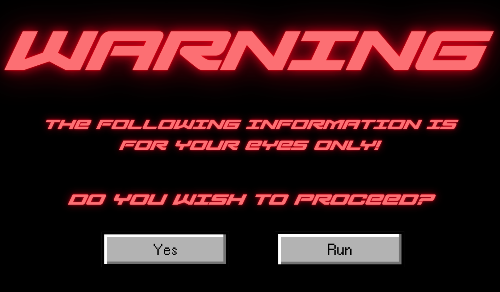

# EXØS: A Digital Resistance Experience

## Overview 🌐
EXØS is a 10-page interactive web experience exploring the systems and psychological impact of surveillance capitalism. Through animations, glitches, interrogation sequences, XP aesthetics, and narrative escalation, the user experiences how their data is interpreted, manipulated, and ultimately reclaimed.

---

## Features ☆
- CRT boot sequences  
- Typewriter + glitch animations  
- Behavioral profiling interaction  
- XP-style “chaos desktop”  
- Custom cursor  
- Video background transitions  
- Final “End of Transmission” shutdown sequence  
- Fully responsive design (mobile-friendly)

---

## Technologies Used 💾
- **HTML5**  
- **CSS3** (keyframes, filters, animations, responsiveness)  
- **JavaScript** (timers, logic flow, user input, page transitions)  
- **Adobe Stock** (WEBM, MP4)
- **Pinterest** (PNGS, WEBM, MP4, custom cursor)
- **Canva** (Styling)
- **Satūs** (Inspiration for Navigation page)

---

## Page Breakdown 👁️⊹ ࣪ ˖
### **Page 1 — TRANSMISSION RECEIVED**
CRT startup animation introducing EXØS.

### **Page 2 — NAVIGATION PAGE**
*(Describe what page 2 does once you're done editing it.)*

### **Page 3–6 — SYSTEM BEHAVIORS**
Exploration of curated truths, algorithmic shaping, data influence.

### **Page 7 — BEHAVIORAL PROFILING**
The machine interrogates the user and “logs” emotional vulnerabilities.

### **Page 8 — DIGITAL DEFIANCE**
XP desktop chaos representing rebellion/creativity.

### **Page 9 — JOIN THE RESISTANCE**
Blurred video background + CTA to “open your eyes.”

### **Page 10 — END OF TRANSMISSION**
Final shutdown mirroring Page 1. Closure of the narrative.

---

## Artistic Statement 🔗
This project critiques how surveillance capitalism profiles users, shapes behavior, and monetizes emotion. By putting the viewer through a playful-yet-unsettling digital ritual—interrogations, glitches, false personalization, distraction—the experience mirrors real digital ecosystems that collect data to manipulate users.

EXØS aims to reveal these hidden systems and empower viewers to resist, reflect, and reclaim agency.

---

## Screenshots & Photos 🛸🩻

---

## Credits 🫧
Created by **LIA !!**  
Course: **[CART211]**  
Semester: **FALL 2025**

---

## License / Notes 🌌
For educational use only. Assets used fall under project guidelines.
